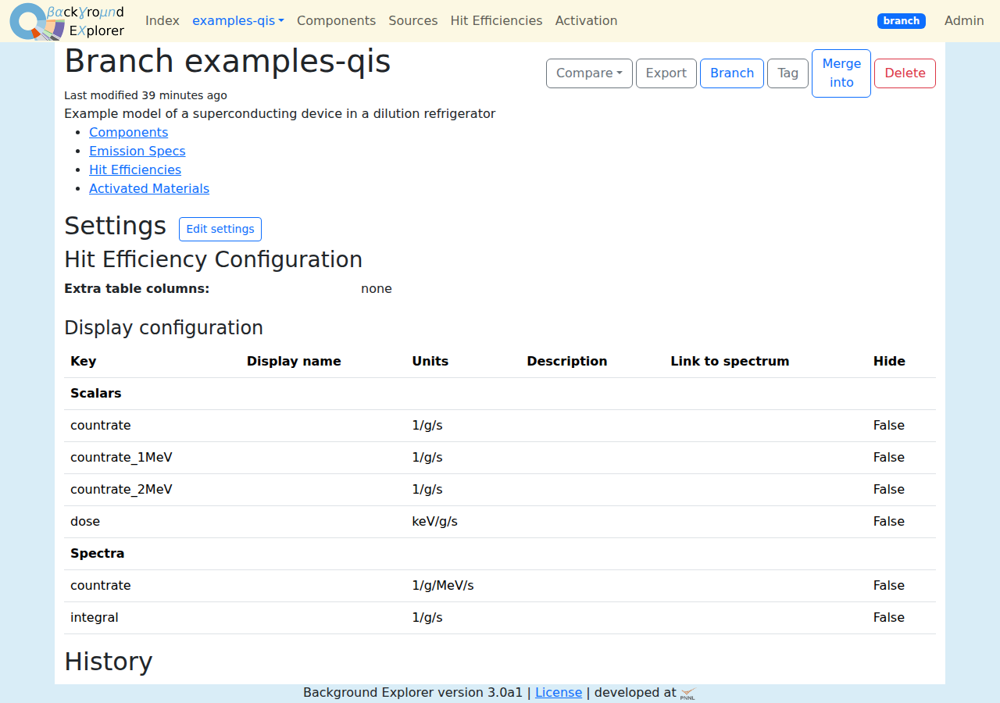
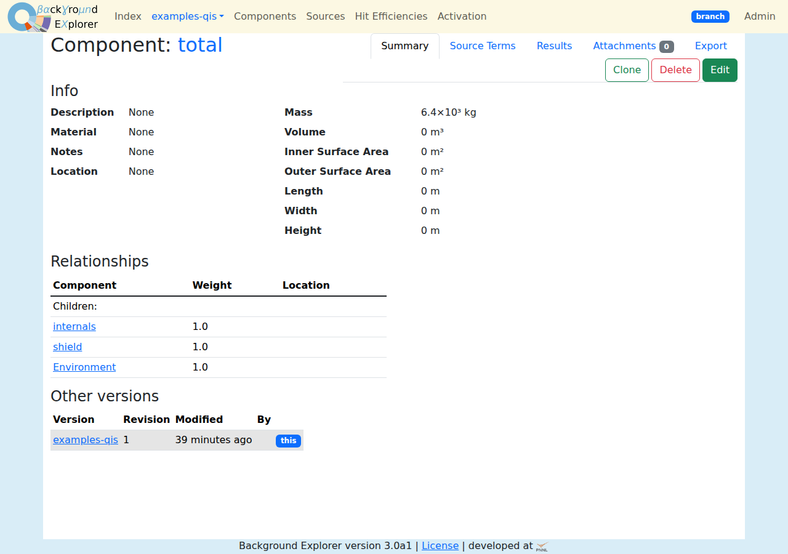
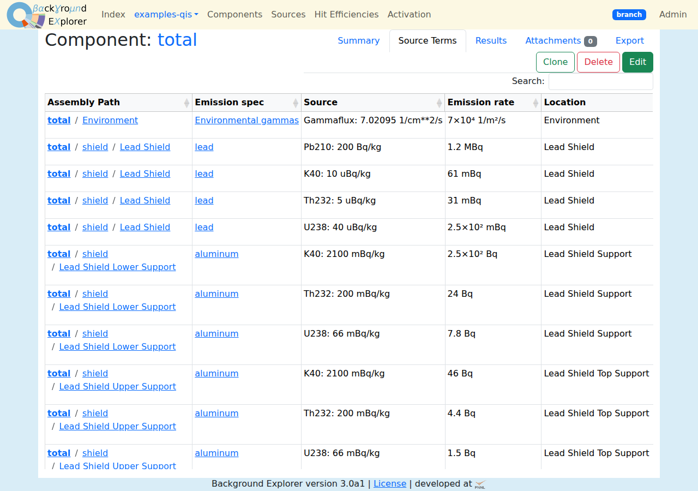

# Getting started
{: .no_toc }

1. TOC
{:toc}

## Run a server with Docker

The simplest way to run Background Explorer is with Docker Compose, which
starts the web server and a MongoDB database. From a copy of the repository:

```sh
git clone https://github.com/bloer/bgexplorer3.git
cd bgexplorer3
docker compose up -d
```

Open <http://localhost:8000>. Set `BGEXPLORER_PORT` to use another port, e.g.
`BGEXPLORER_PORT=8080 docker compose up -d`.

The database is kept in the `mongo-data` Docker volume, so it survives
restarts and upgrades. To upgrade, pull the new code and run
`docker compose up -d --build`.

## Create the first site admin

A new server has no users. Every page shows a banner, "This server has no site
admin yet", linking to the setup page. It asks for a one-time **setup token**,
which the server writes to its log when it starts:

```sh
docker compose logs web | grep token
```

Enter the token, a user name and a password. You are logged in as the site
admin, and can then [add other users](admin.html#users).

{: .note }
The token makes sure that only someone who can see the server's log can claim
a new server. You can also create users on the command line, see
[CLI](cli.html#bgexplorer-users).

## Run without Docker

You need Python 3.10 or later and a MongoDB server.

```sh
pip install '.[server]'
export FLASK_MONGODB_URI=mongodb://localhost:27017/bgexplorer
gunicorn --bind 0.0.0.0:8000 'bgexplorer:create_app()'
```

For a quick local server, `flask --app bgexplorer run --debug` also works.
See [Administration](admin.html#configuration) for all the configuration
options.

## Load the example model

The repository includes a small example: a superconducting device in a
dilution refrigerator, with assays and simulated hit efficiencies. Load it
into the version `examples-qis` with:

```sh
python -m bgexplorer.application.examples.qis mongodb://localhost:27017/bgexplorer
```

or, with Docker:

```sh
docker compose exec web python -m bgexplorer.application.examples.qis mongodb://mongo:27017/bgexplorer
```

This takes a minute or so. It replaces the `examples-qis` version if it
already exists, but doesn't touch any other version.

## A tour

1. The **index** page lists the versions. Click `examples-qis`.
2. The version's **overview** shows its settings and history, and links to its
   collections. The navigation bar has **Components**, **Sources** (emission
   specs), **Hit Efficiencies** and **Activation**.

   
3. Open **Components** and pick the root assembly, `total`. Its **Summary**
   tab shows its children and radiation sources.

   
4. The **Source Terms** tab lists every source on every component inside it,
   with the hit efficiencies each one matched.

   
5. The **Results** tab shows the background contributions table, the
   interactive budget plots and the spectra. Click labels in the budget plots
   to filter everything else. See [Results](results.html).
6. To make changes without affecting the example, go back to the index and
   make a **Branch** of it. Edit there, then **Compare** with the original
   from the overview.
