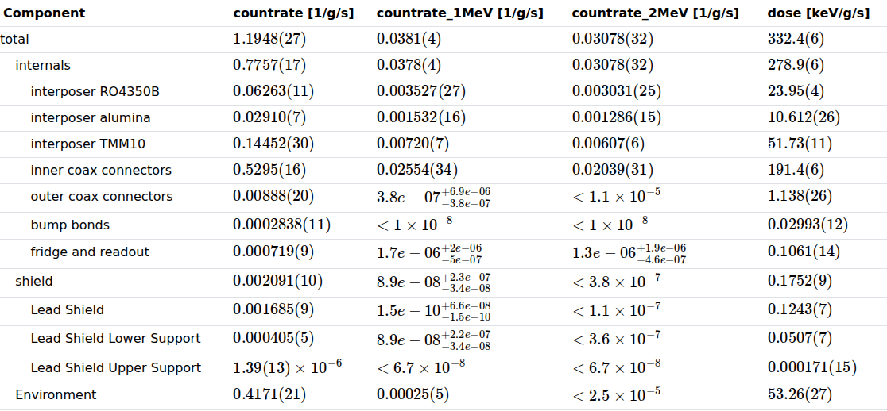
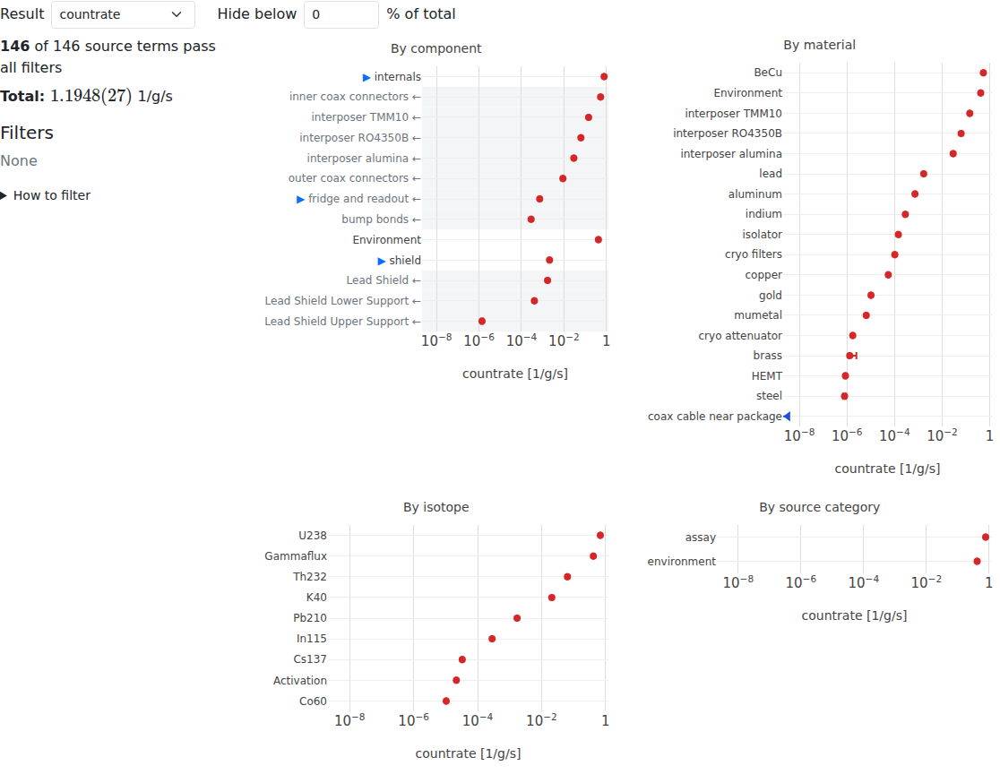
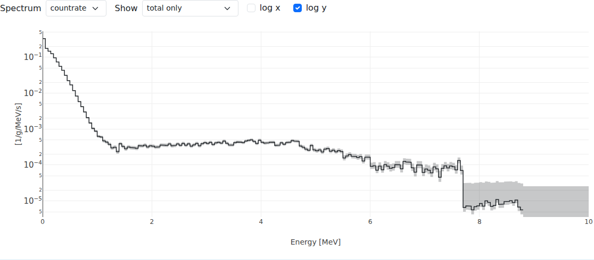

# Results
{: .no_toc }

1. TOC
{:toc}

Every component and assembly has a **Results** tab. It shows the background
from everything in it: a table of contributions, interactive budget plots, and
spectra. All three follow the same filters.

The values shown are the hit efficiency scalars, regions of interest and
spectra chosen for display in the version [settings](settings.html#hit-efficiency-display),
in their display units.

## Background contributions

The table has a row for each component in the tree, indented by depth, and a
column for each displayed scalar. Each value is the sum of everything below
it, with its uncertainty. Symmetric uncertainties are written in the
last digits, e.g. `1.1948(27)` is 1.1948 ± 0.0027; asymmetric ones as a
superscript and subscript; and limits as `< 1.1×10⁻⁵`. When the budget plots are filtered, the table only
includes the SourceTerms that pass, and says how many of them that is.

## Budget plots

The budget plots break down one result, chosen with **Result**, four ways:

- by **component**, two levels deep;
- by **material** (components without a material are listed by name);
- by **isotope**, i.e. source name;
- by **source category**, e.g. assay, radon, activation.

Values are drawn as red points with 1σ error bars, and upper limits as blue
lines ending at their 90% upper limit. A row that is a sum of measurements and
limits is a measurement; it is only a limit if everything in it is.

{: .note }
Error bars and limits use different confidence levels, so a value that
includes a large limit can have an error bar reaching less far than the limit
alone would.

**Hide below** hides rows smaller than a percentage of the total. All panels
share one horizontal axis: drag across a chart to zoom, double-click to zoom
out.

### Filtering

The plots filter each other, crossfilter style:

- **Click** a label to keep only its contributions; click again to undo.
- **Ctrl-click** (Cmd-click on a Mac) a label to remove its contributions.
- **Hold Shift** to pick several labels; they are applied when you release
  Shift.
- Each chart is filtered by the others; its own selection is shaded.
- Click the **▶** before an assembly to show what's inside it. A breadcrumb
  shows where you are; rows ending in ← are inside the row above.

The info box shows how many SourceTerms pass all filters, the filtered and
unfiltered totals, and the active filters, each with ✕ to remove it, and
**reset all**.

The filters are kept in the page's URL, so a filtered view can be bookmarked
or shared.

All sums are done on the server, so the filtered totals keep the
[correlations](uncertainties.html) between their parts: e.g. two components
using the same assay add their uncertainties linearly.

## Spectra

The spectrum plot shows one **Spectrum** at a time. **Show** chooses the total
only, or a breakdown by component, isotope, material or source category; the
largest four groups are drawn, and the rest summed as "other". **log x** and
**log y** switch the axes.

The shaded bands are 1σ errors. Bins that are upper limits are shaded, more
lightly, up to their one-sided 1σ (84.13%) upper limit.

## Results relative to an assembly

A component can be placed in several assemblies. Its Results tab normally
shows the component on its own. Add `?relativeto=<assembly id>` to the URL of
its Results tab to show only its contribution as placed in that assembly,
including the placement weights; the page then says "as placed in" the
assembly. The setting is kept when you switch tabs.
